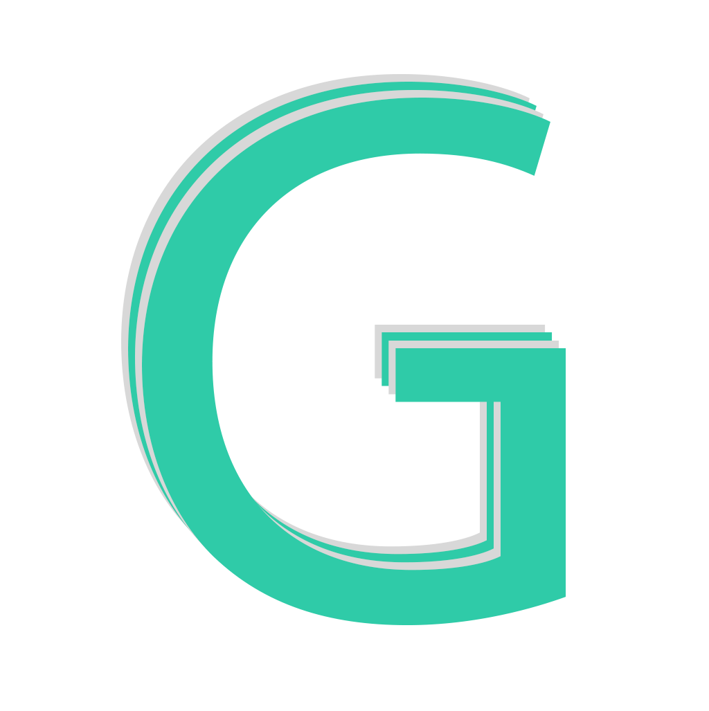

<div id="top"></div>

[![Contributors][contributors-shield]][contributors-url]
[![Forks][forks-shield]][forks-url]
[![Stargazers][stars-shield]][stars-url]
[![Issues][issues-shield]][issues-url]

<!-- PROJECT LOGO -->
<br />
<div align="center">
  <a href="https://github.com/jaronsgit/goodgift">
    
  </a>

  <h3 align="center">GoodGift</h3>

  <p align="center">
    GoodGift's mission is to fight climate change by revolutionising the way climate action campaigns raise funds.
    <br />
    .
    <br />
    <br />
    <a href="https://goodgift.vercel.app/">View Demo</a>
    .
    <a href="https://github.com/jaronsgit/goodgift/issues">Report Bug</a>
    .
    <a href="https://github.com/jaronsgit/goodgift/issues">Request Feature</a>
  </p>
</div>


<!-- TABLE OF CONTENTS -->
<details>
  <summary>Table of Contents</summary>
  <ol>
    <li>
      <a href="#about-the-project">About The Project</a>
      <ul>
        <li><a href="#built-with">Built With</a></li>
      </ul>
    </li>
    <li>
      <a href="#getting-started">Getting Started</a>
      <ul>
        <li><a href="#prerequisites">Prerequisites</a></li>
      </ul>
    </li>
    <li><a href="#usage">Usage</a></li>
    <li><a href="#roadmap">Roadmap</a></li>
    <li><a href="#contributing">Contributing</a></li>
    <li><a href="#license">License</a></li>
    <li><a href="#contact">Contact</a></li>
  </ol>
</details>


<!-- ABOUT THE PROJECT -->
## About The Project

[![Product Name Screen Shot][product-screenshot]](https://goodgift.vercel.app/)

GoodGift's mission is to fight climate change by revolutionising the way climate action campaigns raise funds.

Furthermore, GoodGift aims to provide people with a direct, impactful way to fight against climate change.

<b>So how do we do this?</b>

We provide a platform for 3 dimensional interactive gifts to be bought and sent to loved ones or even just yourself. 

Each gift is associated with a non profit climate action organisation. 100% of the money raised from the gift purchase goes directly to the organisation.

This is mainly a proof of concept and is not fully functional although a lot of functionality is present. 

<p align="right">(<a href="#top">back to top</a>)</p>


### Built With

* [Next.js](https://nextjs.org/)
* [React.js](https://reactjs.org/)
* [Chakra UI](https://chakra-ui.com/)
* [Firebase](https://firebase.google.com/)
* [React Three Fiber](https://github.com/pmndrs/react-three-fiber)

<p align="right">(<a href="#top">back to top</a>)</p>


<!-- GETTING STARTED -->
## Getting Started

GoodGifts is a simple web app and can be run fairly simply. 

### Prerequisites

Use npm to install all the prerequisite libraries:
* npm
  ```sh
  npm install
  ```

<!-- USAGE EXAMPLES -->
## Usage

To use GoodGifts after installing the prerequisites, run the following command:

```sh
npm run dev
```

After this, a local server will be created on localhost on port 3000 therefore navigate to: http://localhost:3000 with your browser.

<p align="right">(<a href="#top">back to top</a>)</p>


<!-- ROADMAP -->
## Roadmap


- [ ] Add the correct virtual models to correspond with the listed products
- [ ] Add payment page
- [ ] Add eco-friendly NFT support


<p align="right">(<a href="#top">back to top</a>)</p>


<!-- CONTRIBUTING -->
## Contributing

Contributions are what make the open source community such an amazing place to learn, inspire, and create. Any contributions you make are **greatly appreciated**.

If you have a suggestion that would make this better, please fork the repo and create a pull request. You can also simply open an issue with the tag "enhancement".
Don't forget to give the project a star! Thanks again!

1. Fork the Project
2. Create your Feature Branch (`git checkout -b feature/AmazingFeature`)
3. Commit your Changes (`git commit -m 'Add some AmazingFeature'`)
4. Push to the Branch (`git push origin feature/AmazingFeature`)
5. Open a Pull Request

<p align="right">(<a href="#top">back to top</a>)</p>


<!-- LICENSE -->
## License

Distributed under the MIT License. See `LICENSE.txt` for more information.

<p align="right">(<a href="#top">back to top</a>)</p>


<!-- CONTACT -->
## Contact

Edan Toledo, Jaron Cohen, Roy Cohen
- edan.toledo -at- live.com
- jdicohen -at- gmail.com
- rtcohen99 -at- gmail.com

<p align="right">(<a href="#top">back to top</a>)</p>


<!-- MARKDOWN LINKS & IMAGES -->
[contributors-shield]: https://img.shields.io/github/contributors/jaronsgit/goodgift.svg?style=for-the-badge
[contributors-url]: https://github.com/jaronsgit/goodgift/graphs/contributors
[forks-shield]: https://img.shields.io/github/forks/jaronsgit/goodgift.svg?style=for-the-badge
[forks-url]: https://github.com/jaronsgit/goodgift/network/members
[stars-shield]: https://img.shields.io/github/stars/jaronsgit/goodgift.svg?style=for-the-badge
[stars-url]: https://github.com/jaronsgit/goodgift//stargazers
[issues-shield]: https://img.shields.io/github/issues/jaronsgit/goodgift.svg?style=for-the-badge
[issues-url]: https://github.com/jaronsgit/goodgift//issues
[product-screenshot]: images/screenshot.png
